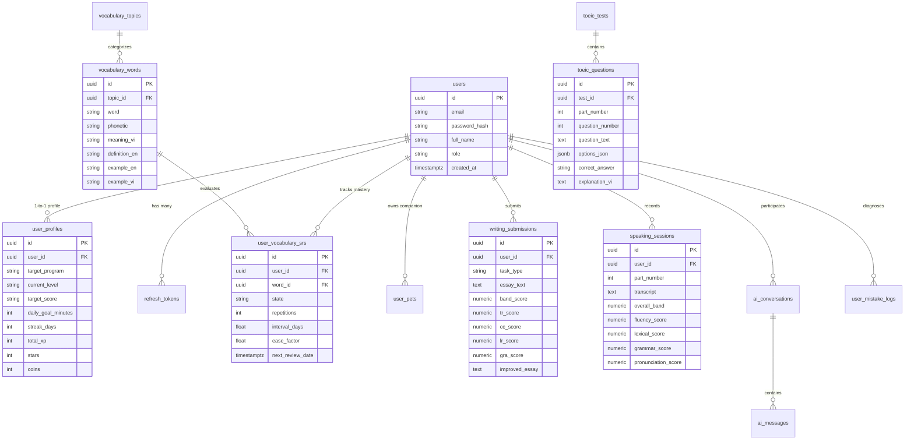

# LINGORA DATABASE ENTITY RELATIONSHIP DIAGRAM (ERD)

Supabase PostgreSQL Relational Schema managed via Entity Framework Core & Npgsql.

```mermaid
erDiagram
    users ||--o{ user_profiles : "1-to-1 profile"
    users ||--o{ refresh_tokens : "has many"
    users ||--o{ user_vocabulary_srs : "tracks mastery"
    users ||--o{ user_pets : "owns companion"
    users ||--o{ writing_submissions : "submits"
    users ||--o{ speaking_sessions : "records"
    users ||--o{ ai_conversations : "participates"
    users ||--o{ user_mistake_logs : "diagnoses"

    vocabulary_topics ||--o{ vocabulary_words : "categorizes"
    vocabulary_words ||--o{ user_vocabulary_srs : "evaluates"

    toeic_tests ||--o{ toeic_questions : "contains"
    ai_conversations ||--o{ ai_messages : "contains"

    users {
        uuid id PK
        string email
        string password_hash
        string full_name
        string role
        timestamptz created_at
    }

    user_profiles {
        uuid id PK
        uuid user_id FK
        string target_program
        string current_level
        string target_score
        int daily_goal_minutes
        int streak_days
        int total_xp
        int stars
        int coins
    }

    vocabulary_words {
        uuid id PK
        uuid topic_id FK
        string word
        string phonetic
        string meaning_vi
        string definition_en
        string example_en
        string example_vi
    }

    user_vocabulary_srs {
        uuid id PK
        uuid user_id FK
        uuid word_id FK
        string state
        int repetitions
        float interval_days
        float ease_factor
        timestamptz next_review_date
    }

    toeic_questions {
        uuid id PK
        uuid test_id FK
        int part_number
        int question_number
        text question_text
        jsonb options_json
        string correct_answer
        text explanation_vi
    }

    writing_submissions {
        uuid id PK
        uuid user_id FK
        string task_type
        text essay_text
        numeric band_score
        numeric tr_score
        numeric cc_score
        numeric lr_score
        numeric gra_score
        text improved_essay
    }

    speaking_sessions {
        uuid id PK
        uuid user_id FK
        int part_number
        text transcript
        numeric overall_band
        numeric fluency_score
        numeric lexical_score
        numeric grammar_score
        numeric pronunciation_score
    }
```
